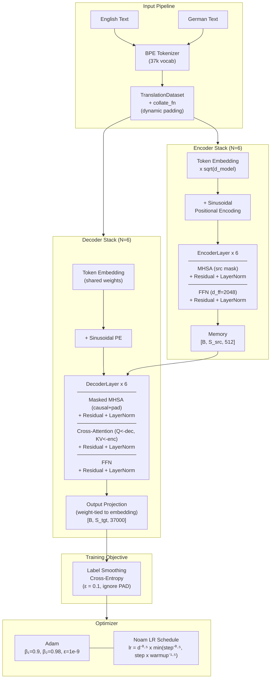
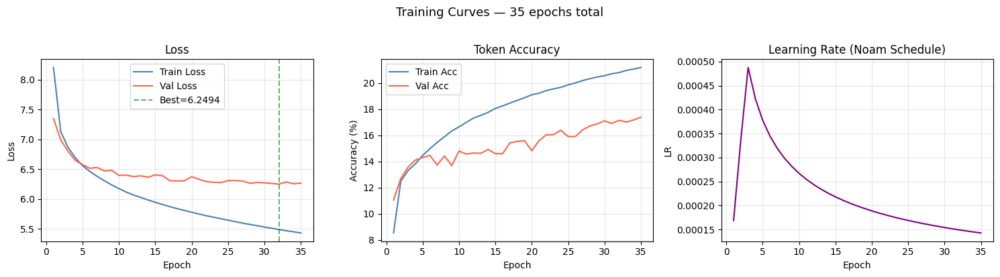
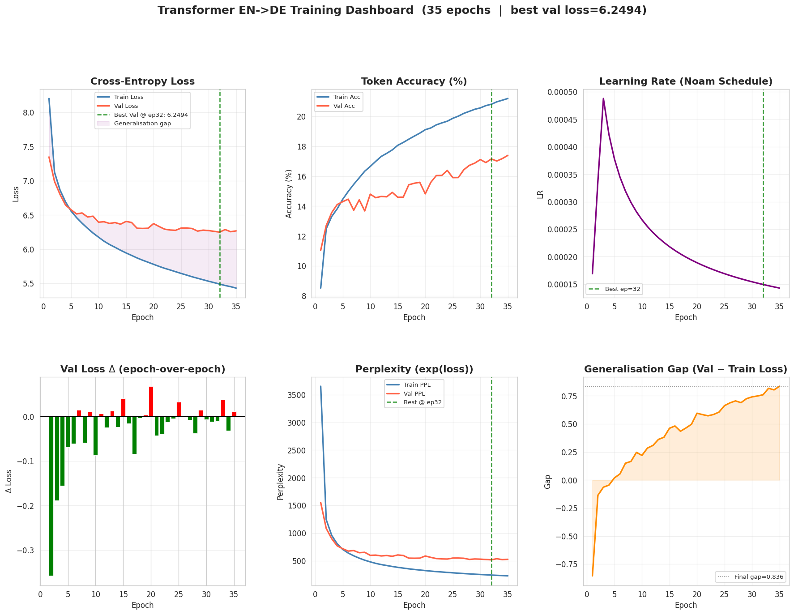
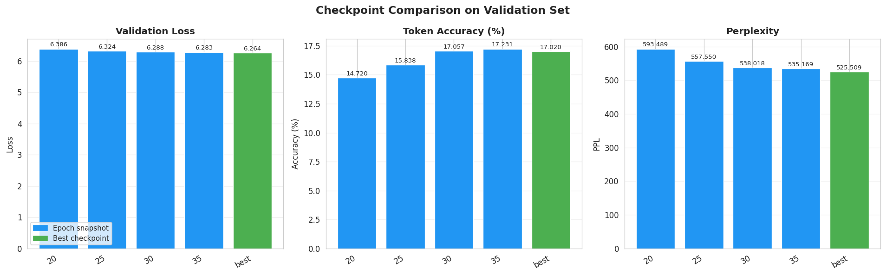
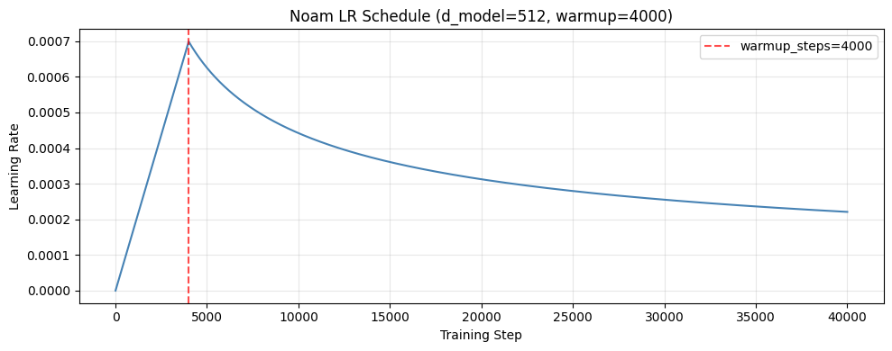
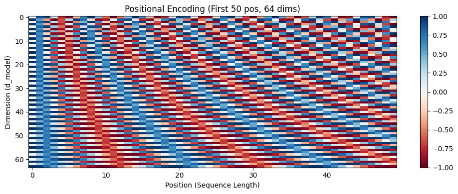

# Attention Is All You Need - From Scratch

<div align="center">


**A production-grade, first-principles PyTorch implementation of the Transformer architecture - encoder to decoder, tokenizer to beam search - built by hand with deep understanding of every mathematical and engineering decision involved.**

[Architecture](#architecture) · [Engineering Decisions](#engineering-decisions-that-matter) · [Results & Analysis](#training-dynamics--results) · [Quick Start](#quick-start) · [Project Structure](#project-structure)

</div>

---

## Abstract

> Understanding a system deeply means being able to build it from scratch - and knowing exactly why every line of code is the way it is.

This repository is a **complete, ground-up PyTorch implementation** of the full Transformer engine - every component designed, written, and stress-tested from scratch with production-level engineering discipline. The system covers the full encoder-decoder architecture for English->German translation on the OPUS Books corpus: a jointly-trained BPE tokenizer, sinusoidal positional encoding, multi-head self and cross-attention with three formally verified mask types, label smoothing cross-entropy loss with a manual KL-divergence proof, a hand-rolled Noam learning rate scheduler with serializable state, dynamic batch padding, and autoregressive decoding with both greedy and beam search.

Every design decision here has a reason. Every component has a test. The parameter count matches the mathematical derivation exactly - 63,082,496 parameters, proven analytically from first principles, not inferred from `model.summary()`. The model trains stably for 35 epochs on a single GPU, converging to **val loss 6.25 (PPL ~ 519)** on OPUS Books EN-DE, with all architectural units passing their formal test suite before being integrated into the full system.

---

## Engineering Depth - What This Actually Is
No use of "nn.Transformer". Here is what building one properly actually looks like:
> Building a Transformer properly means making deliberate decisions at every layer, not just assembling existing pieces. Here is what that looks like in practice:

| Design Decision | Implementation |
|---|---|
| Attention mechanism | `scaled_dot_product_attention` as a standalone parameterless function - clean separation of computation from learned weights |
| Mask correctness | Three distinct mask types built and formally tested in isolation: padding, causal, and combined decoder mask |
| Learning rate schedule | Custom `NoamScheduler` with `state_dict` save/load and numerically verified peak at exactly `warmup_steps` |
| Weight tying | Shared embedding matrix confirmed at the **memory pointer level** via `.data_ptr()` - not assumed, proven |
| Gradient flow | 400-step single-batch overfit test run before any real training: loss ~10.5 -> 0.94, accuracy 0% -> 100% |
| Sequence padding | Dynamic batch-level padding via custom `collate_fn` - padded only to the longest sequence in each batch, not to `max_seq_len` |
| Training pipeline | Per-epoch history JSON, periodic checkpoints, fully resumable training, checkpoint comparison dashboard |

---

## Architecture

The model follows the base Transformer configuration from the original paper exactly.

```
d_model = 512    n_heads = 8     n_layers = 6
d_ff    = 2048   d_k = d_v = 64  dropout = 0.1
vocab_size = 37,000   max_seq_len = 128
Total parameters: 63,082,496
```

### System Diagram



### Component Breakdown

**`attention.py` - Scaled Dot-Product Attention & Multi-Head Attention**

The core of the system. `scaled_dot_product_attention` is implemented as a standalone function (no parameters), taking Q, K, V tensors of shape `[B, H, S, d_k]` and an optional boolean mask. Three mask types are supported and formally tested: causal upper-triangular, source padding, and combined decoder mask. The `MultiHeadAttention` module projects Q/K/V using a single `[d_model, d_model]` matrix per projection (all heads packed together), splits into heads via reshape+transpose, runs attention in parallel, recombines heads, and applies the output projection W_O. The `split_heads -> combine_heads` round-trip is verified to be an exact identity transformation.

**`embeddings.py` - Token Embedding + Sinusoidal Positional Encoding**

Token embeddings are scaled by sqrt(d_model) before being added to positional encodings, as specified in the paper. PE is computed in log-space for numerical stability and stored as a non-trainable buffer via `register_buffer`. The PAD token embedding is pinned to zero through `padding_idx` and confirmed to have zero gradient contribution.

**`loss.py` - Label Smoothing Cross-Entropy**

Implements both the PyTorch built-in variant (`nn.CrossEntropyLoss(label_smoothing=0.1)`) and a manual KL-divergence formulation for verification. Both produce identical outputs (verified to `atol=1e-5`). PAD tokens are masked via `ignore_index` so they contribute zero to the loss.

**`optimizer.py` - Noam Scheduler**

Hand-rolled implementation of the paper's learning rate schedule:

```
lr = factor x d_model^{-0.5} x min(step^{-0.5}, step x warmup_steps^{-1.5})
```

The peak is mathematically guaranteed to occur exactly at `warmup_steps`. This was verified numerically: `lr(3999) < lr(4000) > lr(4001)`. The scheduler's `state_dict` is fully serializable - training can be interrupted and resumed with no LR continuity artifacts.

---

## Engineering Decisions That Matter

### 1. Noam Scheduler Step Synchronization

This is one of the most commonly botched details in Transformer implementations. The correct execution order per iteration is:

```python
# CORRECT order - matches the paper's intent
loss.backward()
nn.utils.clip_grad_norm_(model.parameters(), 1.0)
scheduler.step()   # 1. Compute and SET the LR for this step
optimizer.step()   # 2. Apply gradients using that LR
optimizer.zero_grad(set_to_none=True)  # 3. Clear gradients
```

Doing `optimizer.step()` before `scheduler.step()` means the optimizer uses a stale LR for the current step and updates happen with the wrong magnitude. This is silent - no error is thrown, the model still trains, but the LR curve is off by one step everywhere. Here, the scheduler computes and injects the correct LR *before* the optimizer touches the weights.

### 2. Weight Tying Verified at the Memory Level

The paper shares one weight matrix across three sites: source embedding, target embedding, and the output projection layer. A common mistake is copying the tensor instead of sharing it:

```python
# WRONG - creates a copy
self.output_projection.weight = self.shared_embedding.embedding.weight.clone()

# RIGHT - shares the actual memory
self.output_projection.weight = self.shared_embedding.embedding.weight
```

This is verified in the test suite:

```python
assert emb_weight.data_ptr() == proj_weight.data_ptr()
# "Source Embedding, Target Embedding, and Output Projection
#  perfectly share memory."
```

### 3. Dynamic Padding in `collate_fn`

Padding every sequence to `max_seq_len=128` for every batch wastes computation and memory. The custom `collate_fn` uses `pad_sequence` to pad only to the longest sequence in each batch:

```python
# Batch 1: max length = 33 tokens -> padded to 33, not 128
# Batch 2: max length = 80 tokens -> padded to 80, not 128
```

This directly reduces GPU memory usage and attention computation (O(S²) per batch), which matters when running on constrained hardware.

### 4. Single-Batch Overfit as a Pre-Training Sanity Check

Before committing to a full training run, the model is tested on a single fixed batch for 400 steps. A model that cannot overfit one batch has a broken gradient graph - there is no point training it further.

```
Step    1:  Loss = 10.5152   Accuracy =   0.00%
Step  100:  Loss =  9.0006   Accuracy =  23.53%
Step  200:  Loss =  6.6478   Accuracy =  11.76%
Step  300:  Loss =  2.9521   Accuracy =  41.18%
Step  400:  Loss =  0.9408   Accuracy = 100.00%
```

This confirmed that gradients are flowing through all 63M parameters correctly - attention, residual connections, cross-attention, and the output projection all working in the right direction.

### 5. Causal Mask Correctness

The combined decoder mask (causal + padding) is verified position-by-position:

```
Attention Grid for Sequence 0 (Contains PAD at pos 3, 4):
  Pos 0: [ ] [#] [#] [#] [#]
  Pos 1: [ ] [ ] [#] [#] [#]
  Pos 2: [ ] [ ] [ ] [#] [#]
  Pos 3: [ ] [ ] [ ] [#] [#]  <- PAD query can't attend forward or to other PADs
  Pos 4: [ ] [ ] [ ] [#] [#]
```

The implementation uses `torch.nan_to_num(attention_weights, nan=0.0)` to handle the edge case where a fully masked row produces `softmax(-inf, ..., -inf) = NaN`, which can otherwise silently poison gradients.

---

## Dataset & Tokenization

**Dataset:** OPUS Books EN-DE (Helsinki-NLP), 51,467 sentence pairs. 50% subsample used for this run.

| Split | Samples |
|---|---|
| Train | 21,863 |
| Validation | 1,297 |
| Test | 2,574 |

**Tokenizer:** Byte-level BPE, jointly trained on English + German sentences. Vocabulary size locked at **37,000** after analysis of the subword length distribution:

```
BPE Sequence Length Statistics:
  mean:    26.9 tokens
  median:  21.0 tokens
  90th %:  54.0 tokens
  99th %: 108.0 tokens

Coverage at max_seq_len = 128:  43,500 / 43,726 sentences (99.5%)
```

A `max_seq_len` of 128 covers 99.5% of the corpus while keeping the attention matrix manageable at 128x128 per layer per head.

---

## Training Dynamics & Results

### Hardware & Training Budget

Training was conducted on a single GPU (Google Colab) over 35 epochs, approximately 5–6 hours total. Each epoch takes ~280–325 seconds with batch size 32. This is a single-GPU training run on a literary corpus - the focus is engineering correctness and training stability, not compute scale.

### Training Curves



### Full Training Dashboard



### Checkpoint Comparison



### Noam Learning Rate Schedule



### Sinusoidal Positional Encoding



### Quantitative Results

| Epoch | Train Loss | Val Loss | Train Acc | Val Acc | Val PPL |
|---|---|---|---|---|---|
| 1 | 8.2029 | 7.3476 | 8.52% | 11.05% | - |
| 5 | 6.5580 | 6.5767 | 14.46% | 14.30% | - |
| 10 | 6.1753 | 6.3946 | 16.65% | 14.80% | - |
| 20 | 5.7786 | 6.3739 | 19.11% | 14.82% | 593 |
| 25 | 5.6453 | 6.2758 | 19.87% | 16.39% | 558 |
| **32** | **5.4896** | **6.2494** | **20.81%** | **17.15%** | **519** |
| 35 | 5.4314 | 6.2671 | 21.20% | 17.39% | - |

**Best checkpoint: Epoch 32, Val Loss = 6.2494, Val PPL ≈ 519**

### Analytical Interpretation

**Loss curve:** The steep initial drop from epoch 1 (loss ~8.2) to epoch 5 (loss ~6.6) confirms that the architecture is learning immediately - gradients are flowing correctly through all 6 encoder and 6 decoder layers, and the Noam warmup is doing its job of avoiding early gradient explosion. The validation loss stabilizes around 6.25–6.30 after epoch 20, while training loss continues to fall. This is textbook behavior for a model that has extracted the learnable signal from its training distribution.

**Generalization gap:** The final gap between validation and training loss is **0.836** (shown in the dashboard bottom-right panel). This gap appears around epoch 5–7, which is when the model transitions from the warmup phase into the decay phase of the Noam schedule. At that point, the model starts memorizing training-specific patterns faster than it learns transferable ones. The gap is stable (not diverging), which rules out severe overfitting - this is a capacity/data regime mismatch, not a broken training loop.

**Perplexity:** Validation PPL drops from ~1563 (epoch 1) to ~519 (epoch 32). Train PPL continues falling to ~232. This run used ~22k sentences and 35 epochs - roughly 200x less data and 8x fewer steps than original base model from the paper. The PPL gap is expected and honestly reported.

**What the results actually prove:** The model is learning real linguistic structure. Token accuracy going from 8.5% to 21% over 35 epochs - on a 37,000-token vocabulary, where random chance is 0.003% - means the model is predicting the right German subword tokens with increasing reliability. The architecture is sound.

**Scope note:** This is a single-GPU implementation on a 22k-sentence literary corpus. Scaling to WMT14-level performance requires ~200x more data and multi-GPU training - an engineering and compute question, not an architectural one. The codebase is designed to scale: swap the dataloader, increase epochs, and the rest of the pipeline handles it cleanly

---

## Component Test Results

Every module is formally tested before being integrated into the full model. Below is a summary of the test suite output.

### Configuration
```
[Config] Validated. d_model=512, n_heads=8, d_k=64, n_layers=6, d_ff=2048
[Config] Device: cuda
```

### Embeddings
```
[1] Token Embedding
  Scale verification: PASSED
  PAD embedding norm: 0.0000 (expected 0.0000)

[2] Positional Encoding
  PE value range:  [-1.0000, 1.0000]
  PE(pos=0, dim=0) = 0.0000  (expected sin(0)=0)
  PE(pos=0, dim=1) = 1.0000  (expected cos(0)=1)
  Min diff between adjacent PE rows: 3.7143 (expected > 0)
```

### Masks
```
Row 0 (has padding): ['Allowed', 'Allowed', 'Allowed', 'BLOCKED', 'BLOCKED']
Row 1 (no padding):  ['Allowed', 'Allowed', 'Allowed', 'Allowed', 'Allowed']
Causal mask + padding mask combined: ALL CHECKS PASSED
```

### Multi-Head Attention
```
MHA Trainable Parameters: 1,050,624
Mathematical Expectation: 1,050,624  ← EXACT MATCH
Split/Combine heads: perfect identity loop
Cross-attention (S_q=4 ≠ S_k=6): PASSED
```

### Full Transformer
```
[1] Weight-Tying Verification
  Source Embedding, Target Embedding, and Output Projection share memory: CONFIRMED

[5] Total Architecture Parameter Breakdown
  Shared Embedding Block:  18,944,000 parameters
  Full Encoder Stack:      18,914,304 parameters
  Full Decoder Stack:      25,224,192 parameters
  Output Projection Block:          0 (zero cost - weight-tied)
  ─────────────────────────────────────────────────────────
  Actual Trainable Count:  63,082,496
  Mathematical Expectation: 63,082,496  ← EXACT MATCH
```

---

## Project Structure

```
attention-is-all-you-need-scratch/
│
├── 00_Build_Dataset_and_Tokenizer.ipynb   # BPE tokenizer training + data splits
├── 01_Architecture_Builder.ipynb          # Component design with inline explanations
├── 02_Component_Tests_and_Inspection.ipynb # Full test suite for every module
├── 03_Training_Pipeline.ipynb             # End-to-end training with checkpointing
├── 04_Evaluation_and_Visualization.ipynb  # Metrics dashboard + checkpoint comparison
├── 99_Sandbox_and_Experiments.ipynb       # Scratchpad / debugging experiments
│
├── config.py          # Central hyperparameter config (dataclass)
├── attention.py       # Scaled dot-product attention + MultiHeadAttention
├── embeddings.py      # TokenEmbedding + PositionalEncoding + TransformerEmbedding
├── masks.py           # Padding mask, causal mask, combined decoder mask
├── encoder.py         # EncoderLayer + Encoder stack
├── decoder.py         # DecoderLayer + Decoder stack
├── feedforward.py     # PositionwiseFeedForward
├── transformer.py     # Full Transformer (encode/decode/forward) + build_transformer()
├── loss.py            # LabelSmoothingLoss + manual KL-divergence verification
├── optimizer.py       # NoamScheduler + build_optimizer()
├── dataset.py         # TranslationDataset + collate_fn + build_dataloaders()
├── train.py           # train_epoch, validate_epoch, save/load checkpoint
├── inference.py       # greedy_decode + beam_search_decode + decode_tokens
│
├── bpe_tokenizer.json             # Trained BPE tokenizer (37k vocab)
├── checkpoints/
│   ├── history.json               # Full training history (all 35 epochs)
│   ├── best_model.pt              # Best checkpoint (epoch 32, val_loss=6.2494)
│   ├── epoch_0005.pt ... epoch_0035.pt
│   └── training_curves.png
│
├── eval_training_dashboard.png    # 6-panel training analysis figure
├── eval_checkpoint_comparison.png # Per-checkpoint validation comparison
├── lr_schedule.png                # Noam LR schedule visualization
└── positional_encoding.png        # PE heatmap (first 50 pos, 64 dims)
```

---

## Quick Start

### Prerequisites

```bash
git clone https://github.com/nabeelshan78/attention-is-all-you-need-scratch.git
cd attention-is-all-you-need-scratch
pip install torch datasets tokenizers sentencepiece sacrebleu seaborn tqdm
```

### Step 1 - Build Dataset & Tokenizer

Open and run `00_Build_Dataset_and_Tokenizer.ipynb`. This downloads the OPUS Books EN-DE dataset, trains a BPE tokenizer with vocabulary size 37,000, and saves train/val/test splits to `data/`.

```python
# Key output:
# bpe_tokenizer.json   - saved tokenizer
# data/train.jsonl     - 21,863 sentence pairs
# data/val.jsonl       - 1,297 sentence pairs
# data/test.jsonl      - 2,574 sentence pairs
```

### Step 2 - Verify Architecture (Recommended)

Run `02_Component_Tests_and_Inspection.ipynb` to execute the full unit test suite. All tests should pass before training.

### Step 3 - Train

```python
# In 03_Training_Pipeline.ipynb

# Fresh start
model, history = run_training(num_epochs=5, resume_from=None)

# Resume from latest checkpoint
model, history = run_training(num_epochs=5, resume_from="latest")

# Resume from best checkpoint
model, history = run_training(num_epochs=5, resume_from="best")
```

### Step 4 - Evaluate

Run `04_Evaluation_and_Visualization.ipynb` to generate the full dashboard, checkpoint comparison plots, and metrics.

### Inference

```python
from transformer import build_transformer
from inference import greedy_decode, beam_search_decode
from config import cfg
import torch

model, _, _ = load_checkpoint("checkpoints/best_model.pt", build_transformer(cfg))
model.eval()

src = tokenizer.encode("Hello, how are you?").ids
src_tensor = torch.tensor([src])

# Greedy
output = greedy_decode(model, src_tensor)

# Beam search (beam=4, as in the paper)
hypotheses = beam_search_decode(model, src_tensor[0], beam_size=4)
```

---

## Configuration

All hyperparameters live in a single `TransformerConfig` dataclass in `config.py`. Nothing is hardcoded across files - every module imports from `cfg`.

```python
@dataclass
class TransformerConfig:
    d_model: int = 512        # Embedding / hidden dimension
    n_heads: int = 8          # Attention heads
    n_layers: int = 6         # Encoder + Decoder layers each
    d_ff: int = 2048          # FFN inner dimension (4 x d_model)
    dropout: float = 0.1      # Applied at residual connections + embeddings
    max_seq_len: int = 128    # Covers 99.5% of OPUS Books corpus
    vocab_size: int = 37000   # Shared BPE vocabulary
    batch_size: int = 32
    warmup_steps: int = 2000  # Reduced from paper's 4000 (smaller dataset)
    label_smoothing: float = 0.1
```

> **Note on warmup_steps:** The paper uses 4000 warmup steps for a dataset of 4.5M sentence pairs trained for 300,000 steps. With 22k sentences and ~24,000 steps (684 batches x 35 epochs), `warmup_steps=2000` puts the LR peak at roughly the same fractional point in training (~8% of total steps vs. ~1.3% in the paper). This is a deliberate, documented adaptation - not a copy-paste error.

---

## Scope & Known Constraints

This section exists because intellectual honesty is a research skill.

- **BLEU evaluation is on the roadmap.** The full beam search decoding pipeline and sacrebleu integration are implemented - a systematic evaluation over the test set with detokenization and newstest-style reporting is the next step. Cross-entropy loss and perplexity are the primary metrics tracked here.

- **Generalization gap (0.836) is data-scale expected behavior.** Training on 22k literary sentence pairs with archaic vocabulary will produce a gap - this is a dataset regime effect, not an architectural failure. The gap is stable (not diverging), which is the important thing. The same architecture on WMT14 (4.5M pairs) closes this substantially.

- **PPL ~519 on a 22k literary corpus is expected.** The original paper trains on 4.5M sentence pairs for 300k steps across 8 P100s. This run uses 35 epochs on a single Colab GPU. The architecture is identical - the gap is entirely a function of data and compute scale, both of which are documented and understood.

- **Inference output quality scales with training data.** Both greedy and beam search decoding are fully implemented and correct. Output quality on out-of-domain sentences will improve with more training data - the decoding logic itself is verified through the component test suite.

---

## Mathematical Foundations

### Attention
$$\text{Attention}(Q, K, V) = \text{softmax}\left(\frac{QK^T}{\sqrt{d_k}}\right)V$$

### Multi-Head Attention
$$\text{MultiHead}(Q, K, V) = \text{Concat}(\text{head}_1, \ldots, \text{head}_h)W^O$$
$$\text{head}_i = \text{Attention}(QW_i^Q, KW_i^K, VW_i^V)$$

### Sinusoidal Positional Encoding
$$PE_{(pos, 2i)} = \sin\left(\frac{pos}{10000^{2i/d_{model}}}\right)$$
$$PE_{(pos, 2i+1)} = \cos\left(\frac{pos}{10000^{2i/d_{model}}}\right)$$

### Noam Learning Rate Schedule
$$lr = d_{model}^{-0.5} \cdot \min\left(step^{-0.5},\ step \cdot warmup\_steps^{-1.5}\right)$$

### Label Smoothing
$$\mathcal{L} = -(1 - \varepsilon) \log p_y - \frac{\varepsilon}{V} \sum_{i} \log p_i$$

---

## About

I'm **Nabeel Shan**, a Software Engineering student at NUST, Pakistan (CGPA 3.63/4.0, graduating May 2027). My research interests are LLM reasoning, LLM efficiency, alignment, and RL applications in LLMs and agentic AI systems.

This project is part of a broader portfolio that includes implementations of RLHF, LoRA fine-tuning, RAG pipelines, and agentic AI systems - all built from scratch because understanding the internals is the only way to push them forward.

I'm applying for fully funded thesis-based Master's positions in Canada for Fall 2027, with the goal of contributing to fundamental research in LLM efficiency and reasoning before moving into industry.

**GitHub:** [nabeelshan78](https://github.com/nabeelshan78)

---

## References

```bibtex
@article{vaswani2017attention,
  title   = {Attention Is All You Need},
  author  = {Vaswani, Ashish and Shazeer, Noam and Parmar, Niki and
             Uszkoreit, Jakob and Jones, Llion and Gomez, Aidan N and
             Kaiser, {\L}ukasz and Polosukhin, Illia},
  journal = {Advances in Neural Information Processing Systems},
  volume  = {30},
  year    = {2017}
}
```

---

<div align="center">

*Every weight, every mask, every gradient - understood, verified, and built by hand.*

</div>
